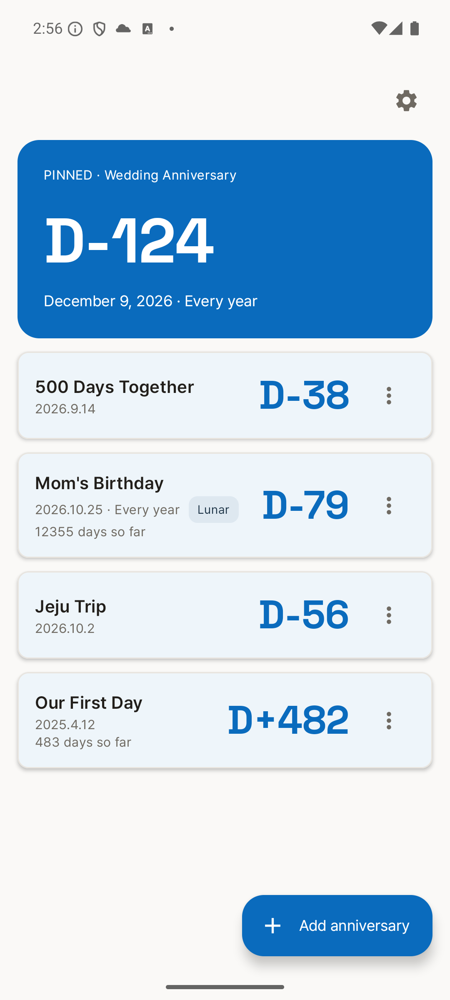
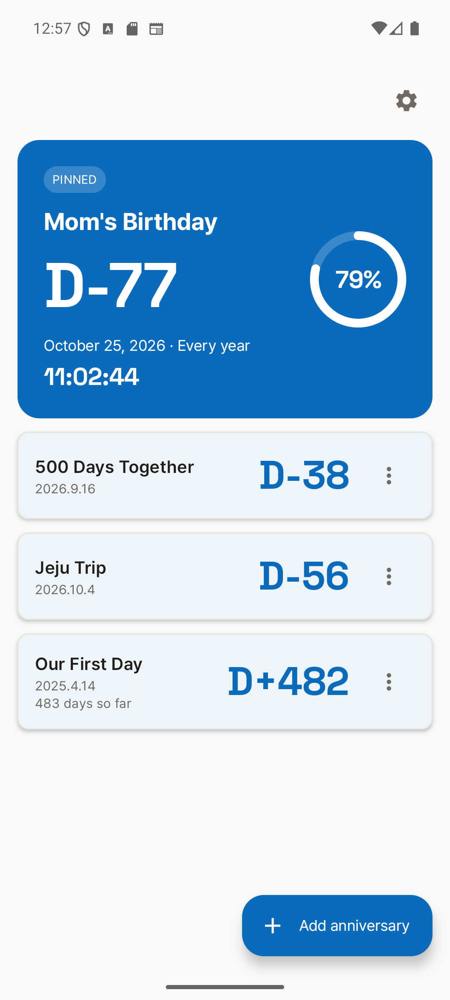
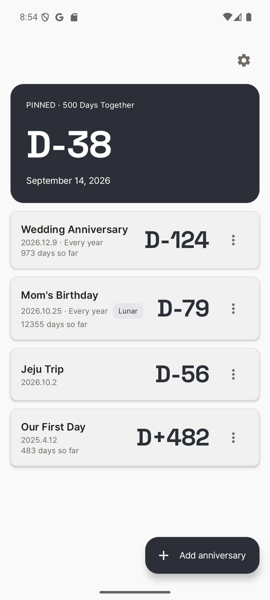
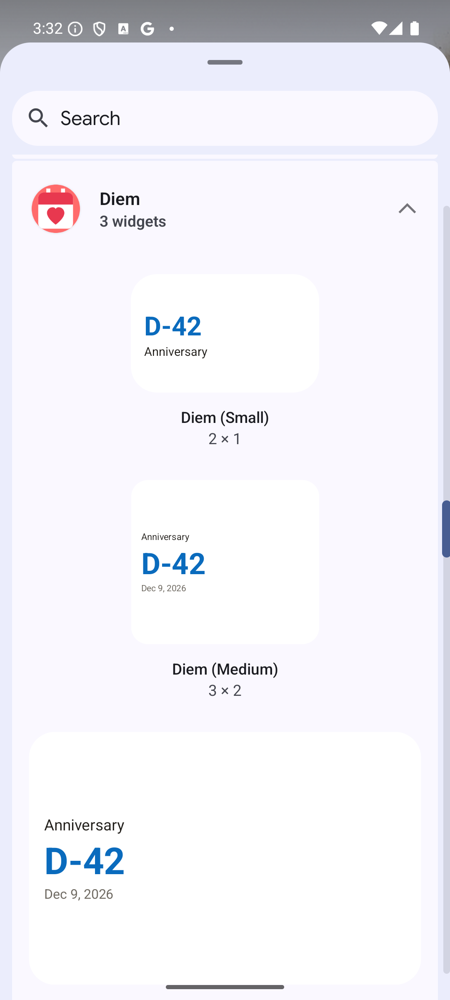

# Diem — D-Day Countdown

> Test distribution for the **Diem** Android app (APK only — source is not published here).
> 테스트 배포용 저장소입니다. APK만 제공되며 소스 코드는 포함되지 않습니다.

Diem is a quiet, numeral-first D-Day / anniversary countdown app for Android.

| Main | Hero (live timer + journey ring) | Mono preset | 3 widget sizes |
|---|---|---|---|
|  |  |  |  |

## Features
- Pinned hero card with live **HH:MM:SS midnight countdown** and an animated **journey progress ring**
- Count-down (D-3) and count-up (D+100) events, yearly repeat, **Korean lunar calendar** support
- **5 color themes** × light/dark, **14 languages** (in-app picker)
- **3 home-widget sizes** (2×1 / 3×2 / 4×2)
- Per-event reminders (no exact-alarm permission needed) and one-tap **Add to Calendar**

## Why "Diem" (이름의 유래)

The name comes from the Latin phrase *carpe diem* — "seize the day." In Latin, *diem* is the accusative of *dies*, and it means simply "a day." That is what this app does: it counts days — the ones left until something, and the ones passed since. "D-Day" is kept as a subtitle keyword rather than the app name itself, because in English the term points first to the Normandy landings.

> 앱 이름은 라틴어 격언 *carpe diem*("현재를 잡아라")에서 가져왔습니다. 라틴어 *diem*은 *dies*(날)의 대격으로, 뜻은 그대로 '하루'입니다. 이 앱이 하는 일도 결국 하루를 세는 것입니다 — 어떤 날까지 남은 하루, 어떤 날로부터 지난 하루. 'D-Day'는 영어권에서 노르망디 상륙작전을 먼저 연상시키는 말이라, 이름 본체가 아니라 부제 키워드로만 씁니다.

## Install (테스트 설치 방법)
1. Go to **[Releases](../../releases)** and download an APK:
   - `diem-x.x.x-release.apk` — production build (clean, no sample data)
   - `diem-x.x.x-demo.apk` — demo build with sample events pre-seeded (for quick preview)
2. Open the APK on your Android device (Android 7.0+ / API 24+).
3. If prompted, allow "Install unknown apps" for your browser/file manager.
   (설정에서 "출처를 알 수 없는 앱 설치 허용"이 필요할 수 있습니다.)

> ⚠️ Test builds show **Google test ads** and ads render only in Korea by default. Do not redistribute.

## Requirements
- Android 7.0 (API 24) or higher

---
© 8bit center. All rights reserved. This repository distributes test binaries only; redistribution of the APK or reuse of assets is not permitted.
